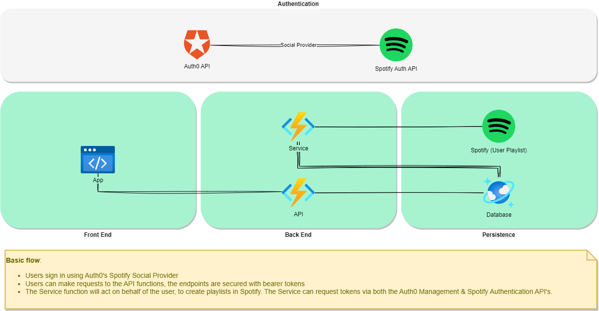

# Soundforest

A quick and dirty proof of concept for an application that can export soundtracks of TV shows and movies to playlists on Spotify.

## Why?

### Functional Reason

I was watching a TV show with great music in it and wanted to compile a playlist of it. It had quite a lot of episodes, it was a bit tedious to do it all manually, so I thought it would be cool to do it in a more automated way. 

### Technical Reason

I wanted to have a look at some of the concepts / technologies below and thought making a proof of concept for an app would be good way going a bit deeper below the surface, beyond "Hello World" type tutorials.

- Vertical Slice
- Blazor
- Tailwind
- Azure Functions
- Azure CosmosDB
- MediatR
- OneOf

## Demo

## Architecture

## Takeaways

### Vertical Slice

This approach is definitely interesting, probably more so on projects with tight deadlines and lots of people involved. There is quite some overhead to it, partly because of it being acceptable to have some duplication, which feels a bit unnatural. It does make you think a bit more on how to structure a project and how to name things.

### Blazor

I dabbled with SvelteKit before and found Blazor to be quite similar. If you are already a dotnet back-end developer, this framework is probably the easiest to transition into some front-end work.

### Tailwind

Last time I touched CSS, was in college and it was not a great experience. Tailwind, makes a lot of things very easy and you can assemble something that look a bit more unique than e.g. bootstrap based applications.

### Azure Functions

I've used Azure Functions before, I think they're great and it's a cheap way to build API's for proof of concepts like this. I used a Cosmos DB trigger to listen to "status" updates on the "exports" container. This would then trigger a different action, depending on the status. In hindsight, I probably wouldn't take this approach again, as there is the possibility of updates not being read when e.g. the trigger is down for a little while. Something like Azure Service Bus, would probably be a better fit.

### Azure Cosmos DB

Cosmos DB is a cool concept and a convenient tool in Azure's offering. I might use it again, for large scale use, I would have to run some cost and performance analysis before picking it.

### MediatR

MediatR is a convenient tool, especially to get things done for a proof of concept and still keep everything structured enough to be able to maintain it. This is the first time I've used Behaviors, it's a pretty neat feature, but I did have some issues with open generic types with them, which were not so clear to figure out.

### OneOf

In my spare time, I like to play around with typescript and one of the things I love a lot about it, is discriminated unions. The OneOf library offers with feature for C# and it's great. I can't wait for Microsoft to offer it as a feature in one of the upcoming C# versions.

## What's Next?

There's lots of refactoring that could be done here, but I consider this project closed. I have a few 100s of hours of songs to listen to now :). Working on this project, I did uncover some interesting topics I want to look into next, so I'll focus on that instead. 

## Disclaimer

This project is for my personal development / learning purposes and is in no way intended for commercial use. There are no affiliations or endorsements between this repository and the resources or tools it makes use of. 
